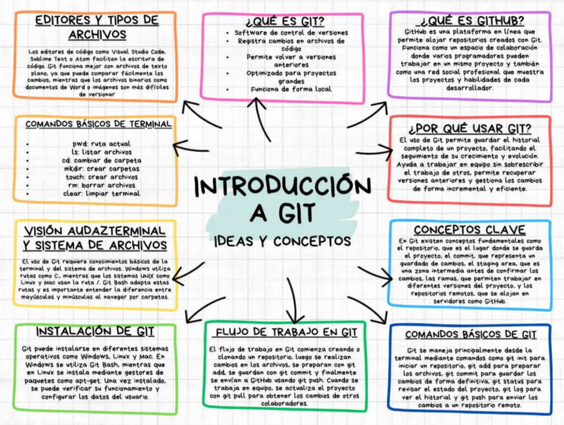
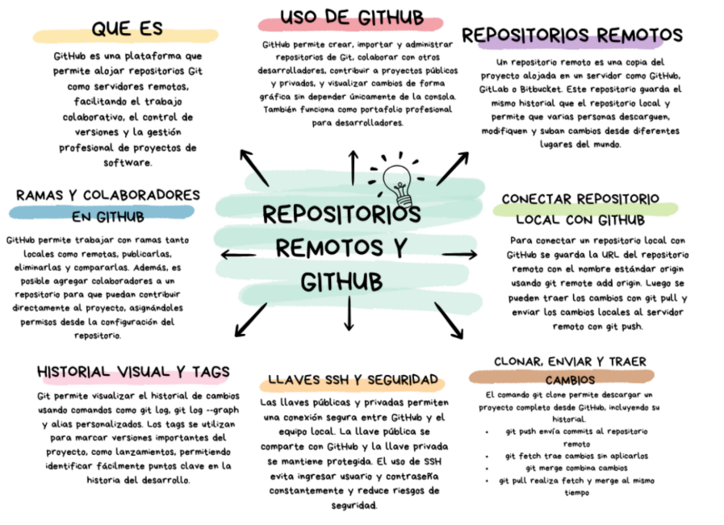
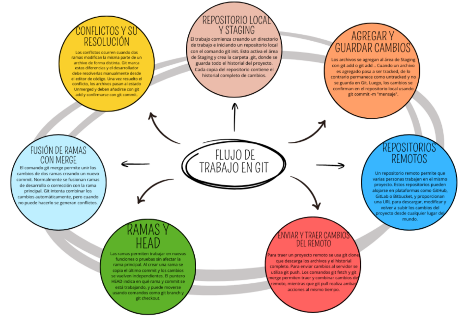

# Mapas conceptuales – Clase del martes

Este repositorio contiene los mapas conceptuales trabajados en la clase del martes,
relacionados con el análisis de procesos y la ingeniería de sistemas.

## Objetivo
Presentar de forma visual y estructurada los conceptos vistos en clase mediante mapas conceptuales.

## Contenido de los mapas

### 🗺️ Mapa 1 – Teoría General de Sistemas
Representa el concepto de sistema como un conjunto de elementos interrelacionados,
mostrando entradas, procesos, salidas y retroalimentación.

---

### 🗺️ Mapa 2 – Procesos a Nivel de Negocio
Describe cómo una organización transforma insumos en resultados,
enfocándose en los procesos clave del negocio.

---

### 🗺️ Mapa 3 – Análisis de Procesos
Muestra el análisis detallado de los procesos,
identificando actividades, responsables y mejoras posibles.

---

### 🗺️ Mapa 4 – Ingeniería de Requisitos
Explica la importancia de recopilar, analizar y documentar
los requisitos del sistema para garantizar su correcto desarrollo.

